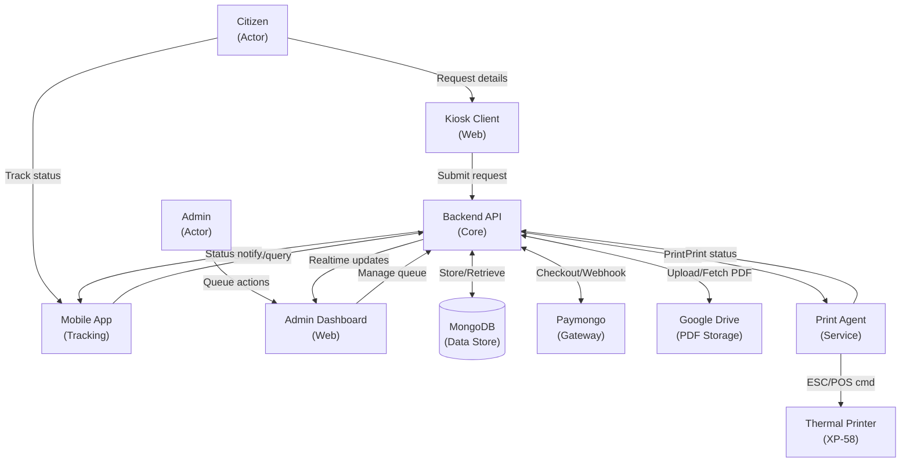
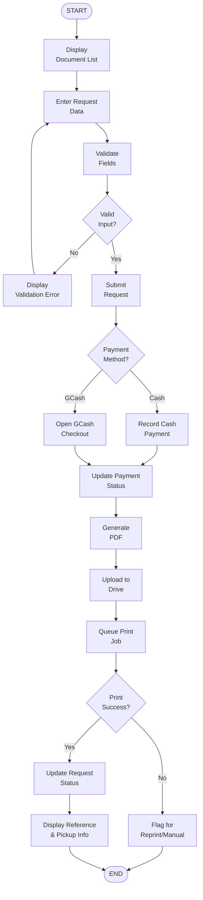
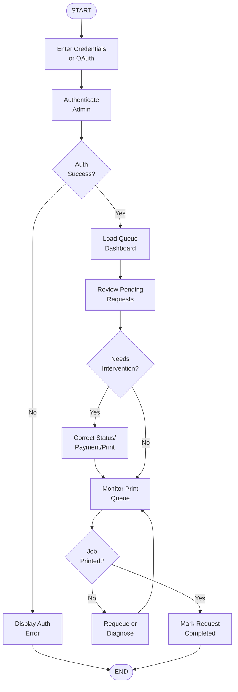
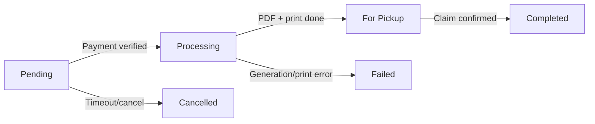
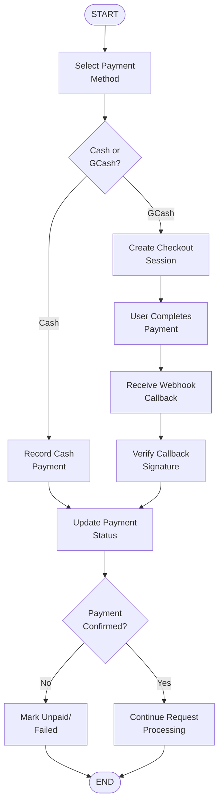
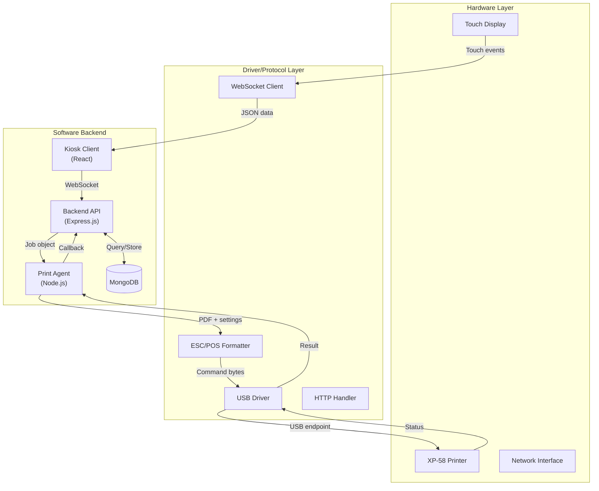
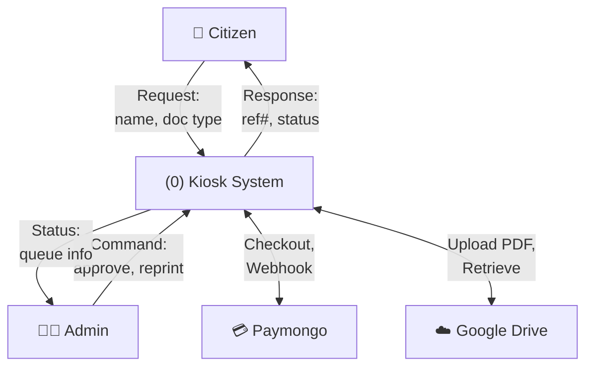

# Mermaid Diagram Starters

These Mermaid diagrams represent the flowchart content and can be:
1. Rendered directly in Mermaid Live Editor (mermaid.live)
2. Imported into Draw.io via Mermaid plugin
3. Used as reference while drawing in Visio/Draw.io with strict ANSI symbols

**Note:** Mermaid renders with modern UML-style symbols. Your final thesis diagrams must convert to strict ANSI flowchart symbols per the legend. These are scaffolds only.

---

## Figure X.1: System Context (Mermaid Reference)



---

## Figure X.2: Citizen Request Processing (Mermaid Reference)



---

## Figure X.3: Admin Operations (Mermaid Reference)



---

## Figure X.4: Request Lifecycle State (Mermaid Reference)



---

## Figure X.5: Payment Integration (Mermaid Reference)



---

## Figure X.6: Print Integration (Mermaid Reference)


---

---

## Figure X.7: Deployment Architecture (Mermaid Reference)

```mermaid
graph LR
    Citizen["👤 Citizens<br/>(Barangay Hall)"]
    
    Kiosk["💻 Kiosk Terminal<br/>(Touch Display)"]
    Printer["🖨️ XP-58<br/>Thermal Printer"]
    
    Network["🌐 Network<br/>(Internet/LAN)"]
    
    Backend["🖥️ Backend Server<br/>(VPS/Cloud)"]
    DB[(["MongoDB<br/>(Data Store)"])]
    
    Paymongo["💳 Paymongo<br/>(Payment Gateway)"]
    Drive["☁️ Google Drive<br/>(PDF Storage)"]
    
    Citizen -->|USB/Power| Kiosk
    Kiosk -->|USB| Printer
    Kiosk -->|HTTP/WebSocket| Network
    Network -->|API<br/>Requests| Backend
    Backend <-->|OAuth<br/>Webhook| Paymongo
    Backend <-->|REST<br/>API| Drive
    Backend --> DB
```

---

## Figure X.8: Hardware-Software Interface (Mermaid Reference)



---

## Figure X.9: Data Flow Diagram L0+L1 (Mermaid Reference - L0 only)



---

## Figure X.10: Error Handling & Recovery (Mermaid Reference)


---

## Figure X.11: Authentication & Security Flow (Mermaid Reference)


---

## How to Use These Mermaid Diagrams

1. **Copy the code block** (between triple backticks)
2. **Paste into Mermaid Live Editor**: https://mermaid.live
3. **Export as SVG** and use as visual reference overlay while drawing in Visio/Draw.io
4. **Draw.io Import**: Use Mermaid plugin to import directly and convert to strict ANSI symbols
5. **Keep finalized diagrams** as ANSI-compliant; these Mermaid versions are scaffolds only

---

## Conversion Notes for ANSI Compliance

When converting from Mermaid to strict ANSI:
- Round/oval nodes → Terminators (Start/End)
- Rectangle nodes → Process boxes
- Diamond nodes → Decision (already strict)
- Cylinder → Data Store (MongoDB)
- Use display symbol for "Display" labeled nodes
- Ensure all bidirectional arrows split into two separate arrows
