# Mermaid Diagram Starters

These Mermaid diagrams represent the flowchart content and can be:
1. Rendered directly in Mermaid Live Editor (mermaid.live)
2. Imported into Draw.io via Mermaid plugin
3. Used as reference while drawing in Visio/Draw.io with strict ANSI symbols

**Note:** Mermaid renders with modern UML-style symbols. Your final thesis diagrams must convert to strict ANSI flowchart symbols per the legend. These are scaffolds only.

---

## Figure X.1: System Context (Mermaid Reference)

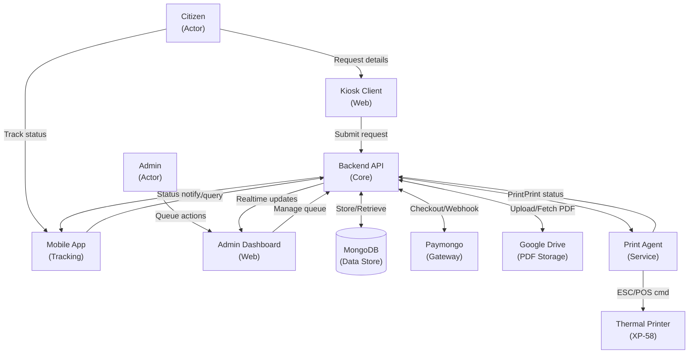

---

## Figure X.2: Citizen Request Processing (Mermaid Reference)

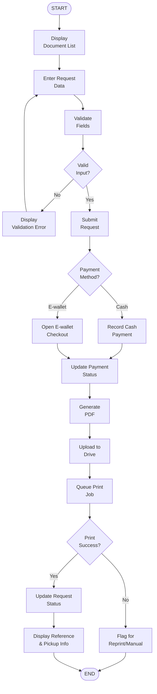

---

## Figure X.3: Admin Operations (Mermaid Reference)


---

## Figure X.4: Request Lifecycle State (Mermaid Reference)

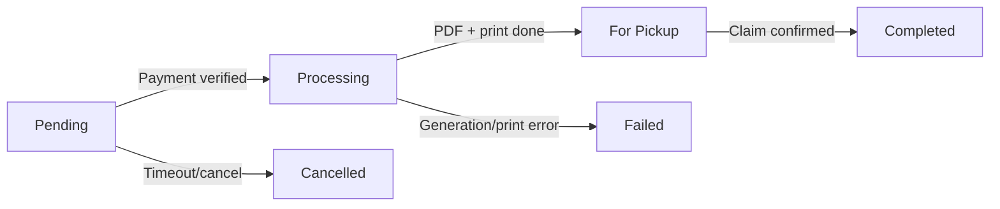

---

## Figure X.5: Payment Integration (Mermaid Reference)

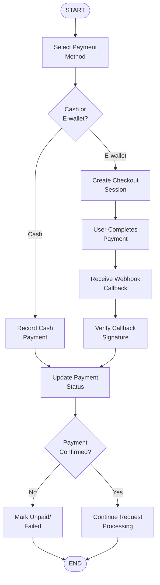

---

## Figure X.6: Print Integration (Mermaid Reference)

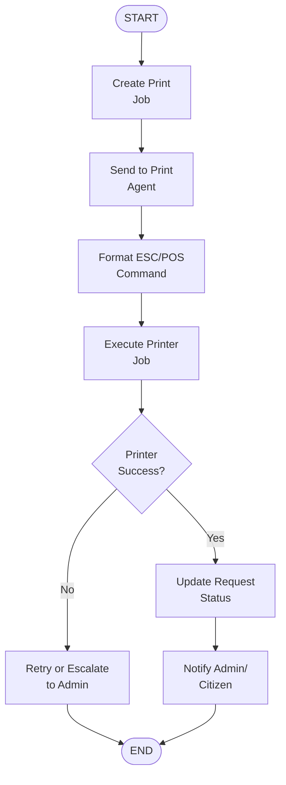

---

---

## Figure X.7: Deployment Architecture (Mermaid Reference)

```mermaid
graph LR
    Citizen["👤 Citizens<br/>(Barangay Hall)"]
    
    Kiosk["💻 Kiosk Terminal<br/>(Touch Display)"]
    Printer["🖨️ XP-58<br/>Thermal Printer"]
    
    Network["🌐 Network<br/>(Internet/LAN)"]
    
    Backend["🖥️ Backend Server<br/>(VPS/Cloud)"]
    DB[(["MongoDB<br/>(Data Store)"])]
    
    Paymongo["💳 Paymongo<br/>(Payment Gateway)"]
    Drive["☁️ Google Drive<br/>(PDF Storage)"]
    
    Citizen -->|USB/Power| Kiosk
    Kiosk -->|USB| Printer
    Kiosk -->|HTTP/WebSocket| Network
    Network -->|API<br/>Requests| Backend
    Backend <-->|OAuth<br/>Webhook| Paymongo
    Backend <-->|REST<br/>API| Drive
    Backend --> DB
```

---

## Figure X.8: Hardware-Software Interface (Mermaid Reference)

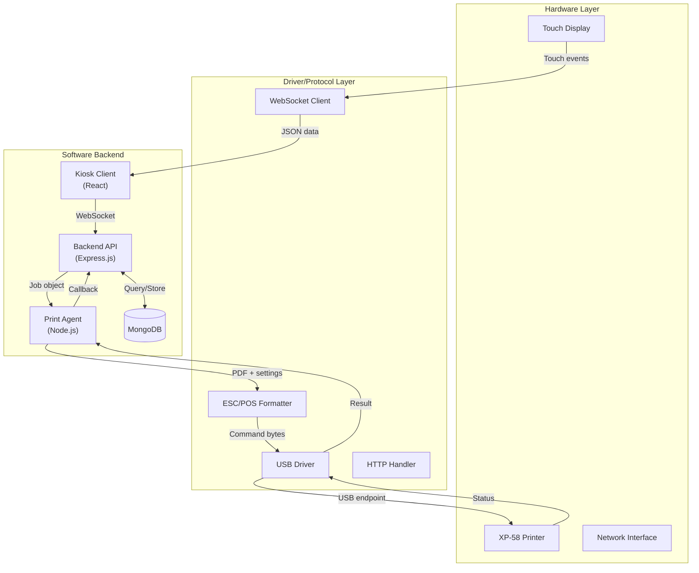

---

## Figure X.9: Data Flow Diagram L0+L1 (Mermaid Reference - L0 only)

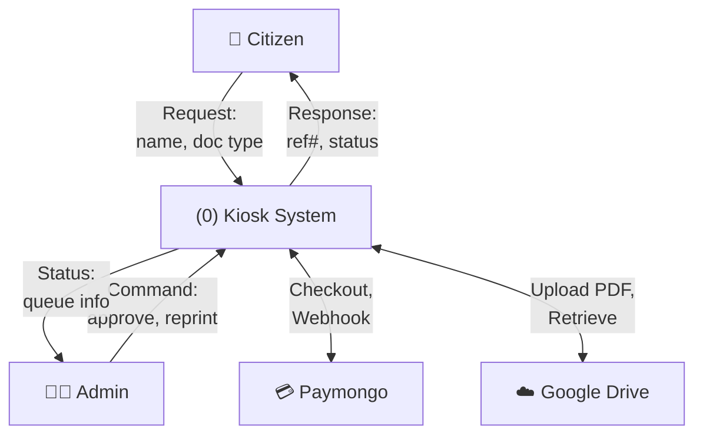

---

## Figure X.10: Error Handling & Recovery (Mermaid Reference)

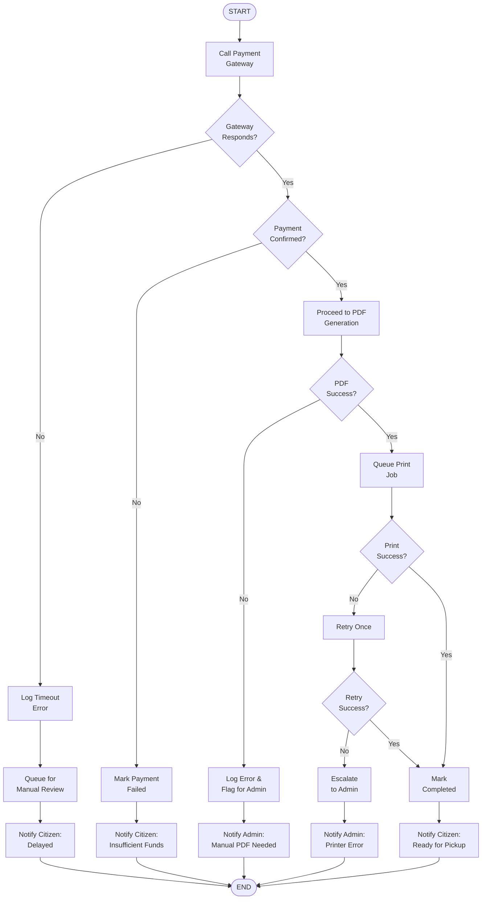

---

## Figure X.11: Authentication & Security Flow (Mermaid Reference)

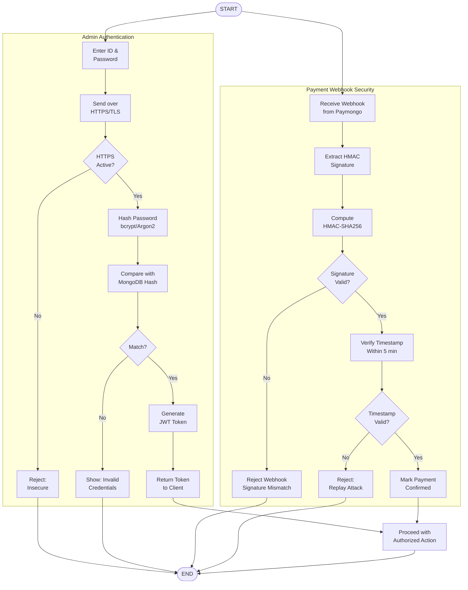

---

## How to Use These Mermaid Diagrams
---

## Figure X.12: Create Request — POST /api/request/create-request (Mermaid Reference)

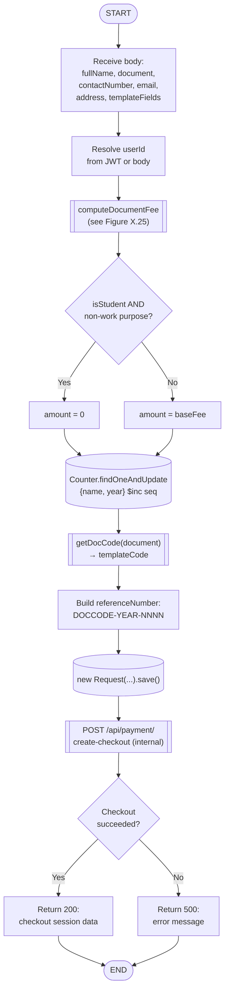

---

## Figure X.13: Create Checkout Session — POST /api/payment/create-checkout (Mermaid Reference)

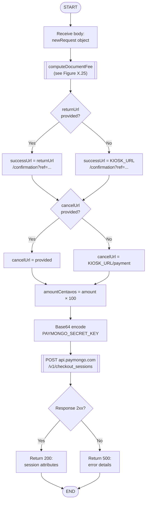

---

## Figure X.14: Create Cash Payment — POST /api/payment/create-cash-payment (Mermaid Reference)

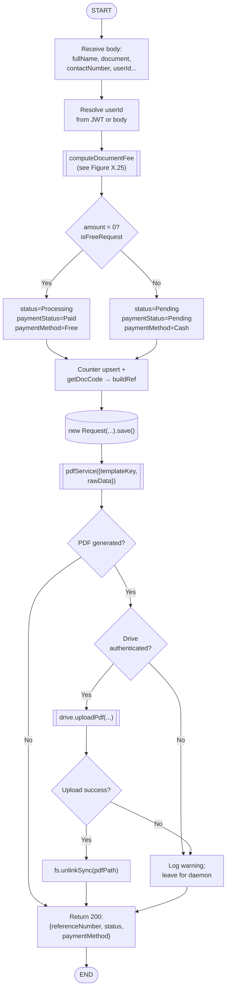

---

## Figure X.15: Handle Payment Webhook — POST /api/payment/handle-webhook (Mermaid Reference)

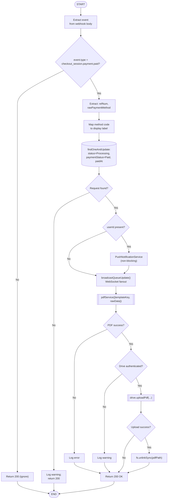

---

## Figure X.16: Generate PDF — POST /api/pdf/generate (Mermaid Reference)

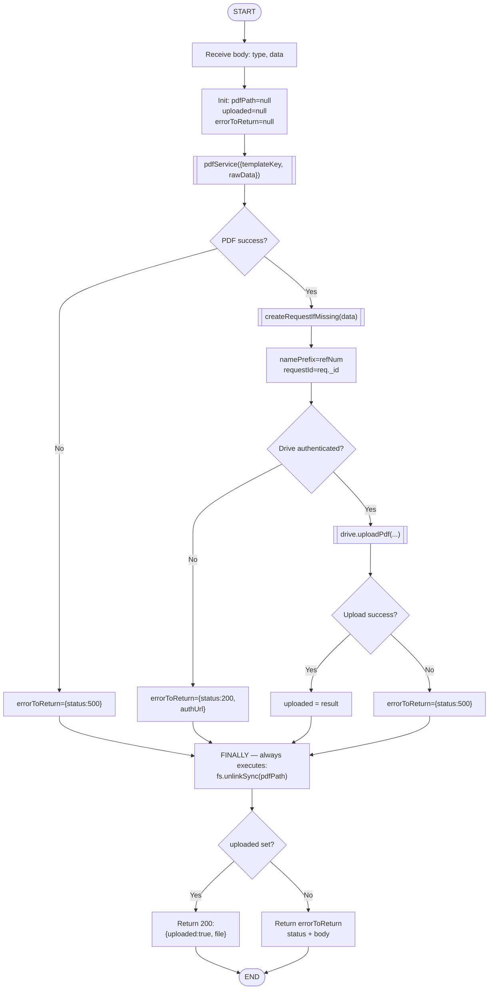

---

## Figure X.17: Update Request Status — PATCH /api/pdf/status/:fileId (Mermaid Reference)

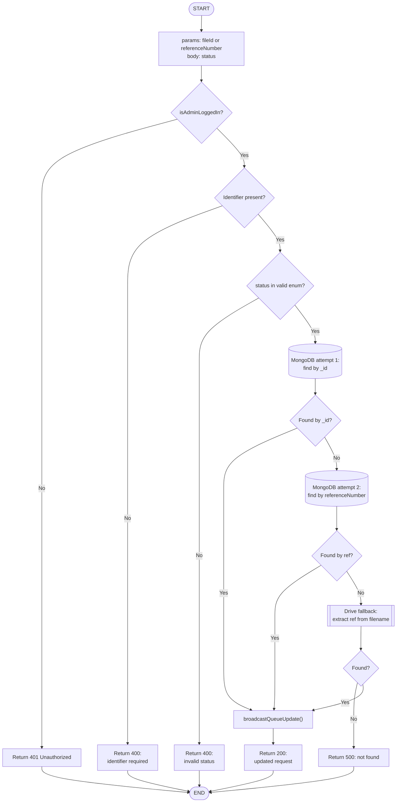

---

## Figure X.18: Print Dispatch — POST /api/print/ (Mermaid Reference)

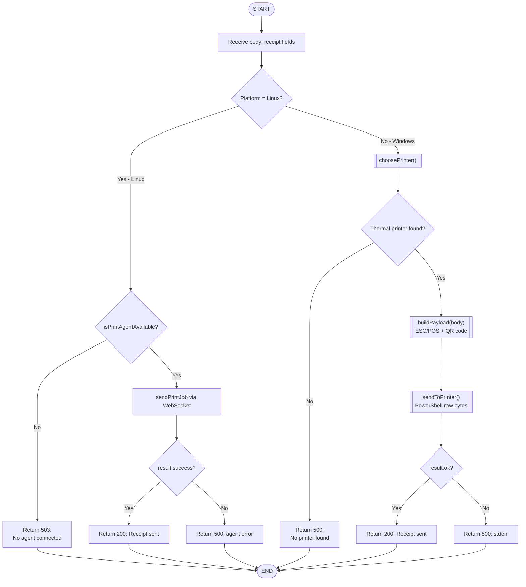

---

## Figure X.19: WebSocket Agent Lifecycle (Mermaid Reference)

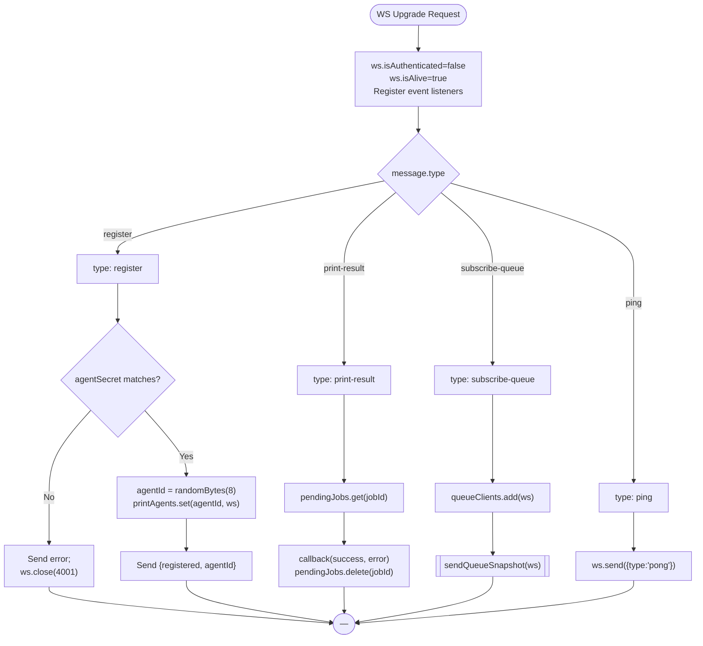

---

## Figure X.20: Queue Snapshot — GET /api/queue/ (Mermaid Reference)

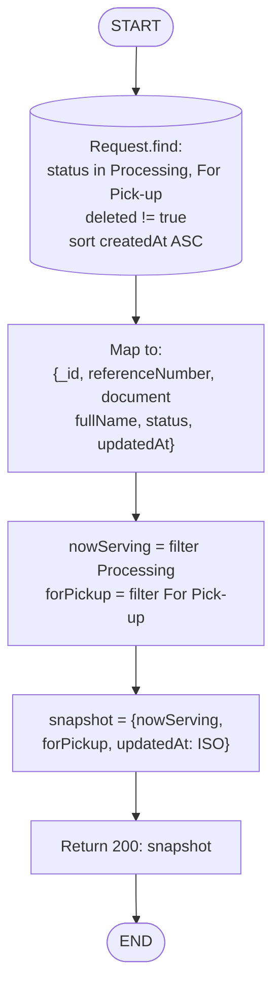

---

## Figure X.21: Request OTP — POST /api/auth/request-otp (Mermaid Reference)

```mermaid
graph TD
    Start(["START"])
    ReadBody["Receive body:<br/>phoneNumber, fullName"]
    PhoneOk{phoneNumber present?}
    Return400["Return 400:<br/>phone required"]
    QueryUser[("User.findOne({phoneNumber})<br/>→ isNewUser flag")]
    GenOTP["OTP = crypto.randomInt(100000,999999)<br/>expiresAt = now + 5 min"]
    FormatPhone["Format: 0XXXXXXXXX → +63..."]
    DevBypass{NODE_ENV=dev AND<br/>SMS_DEV_BYPASS=true?}
    DevMode["Skip SMS;<br/>devMode=true"]
    SendSMS[["POST api.textbee.dev/sendSMS"]]
    SMSOk{SMS sent?}
    Return500SMS["Return 500: SMS error"]
    SignJWT["jwt.sign({phoneNumber, otp,<br/>expiresAt, fullName, isNewUser})"]
    Return200["Return 200:<br/>{otpToken, isNewUser, [devOtp]}"]
    End(["END"])

    Start --> ReadBody
    ReadBody --> PhoneOk
    PhoneOk -->|No| Return400
    Return400 --> End
    PhoneOk -->|Yes| QueryUser
    QueryUser --> GenOTP
    GenOTP --> FormatPhone
    FormatPhone --> DevBypass
    DevBypass -->|Yes| DevMode
    DevBypass -->|No| SendSMS
    DevMode --> SignJWT
    SendSMS --> SMSOk
    SMSOk -->|No| Return500SMS
    Return500SMS --> End
    SMSOk -->|Yes| SignJWT
    SignJWT --> Return200
    Return200 --> End
```

---

## Figure X.22: Verify OTP — POST /api/auth/verify-otp (Mermaid Reference)

```mermaid
graph TD
    Start(["START"])
    ReadBody["Receive body:<br/>otp, otpToken"]
    ParamsOk{otp AND otpToken present?}
    Return400Params["Return 400:<br/>params required"]
    VerifyJWT["jwt.verify(otpToken, JWT_SECRET)"]
    TokenOk{Token valid?}
    Return400Token["Return 400:<br/>token expired/invalid"]
    ExpiryOk{Date.now > expiresAt?}
    Return400Expiry["Return 400: OTP expired"]
    OTPMatch{enteredOTP = storedOTP?}
    Return400OTP["Return 400: Invalid OTP"]
    FindUser[("User.findOne({phoneNumber})")]
    UserFound{User found?}
    CreateUser[("Create User:<br/>phoneNumber, name,<br/>isPhoneVerified=true")]
    UpdateUser[("Update User:<br/>isPhoneVerified=true<br/>lastLoginAt=now")]
    GenTokens[["tokenManager.generateTokens()"]]
    Return200["Return 200:<br/>{token, refreshToken, user}"]
    End(["END"])

    Start --> ReadBody
    ReadBody --> ParamsOk
    ParamsOk -->|No| Return400Params
    Return400Params --> End
    ParamsOk -->|Yes| VerifyJWT
    VerifyJWT --> TokenOk
    TokenOk -->|No| Return400Token
    Return400Token --> End
    TokenOk -->|Yes| ExpiryOk
    ExpiryOk -->|Yes| Return400Expiry
    Return400Expiry --> End
    ExpiryOk -->|No| OTPMatch
    OTPMatch -->|No| Return400OTP
    Return400OTP --> End
    OTPMatch -->|Yes| FindUser
    FindUser --> UserFound
    UserFound -->|No| CreateUser
    UserFound -->|Yes| UpdateUser
    CreateUser --> GenTokens
    UpdateUser --> GenTokens
    GenTokens --> Return200
    Return200 --> End
```

---

## Figure X.23: Google Authentication — POST /api/auth/google (Mermaid Reference)

```mermaid
graph TD
    Start(["START"])
    ReadBody["Receive body:<br/>googleToken, email, fullName"]
    ParamsOk{googleToken AND email present?}
    Return400["Return 400: params required"]
    VerifyGoogle[["GET googleapis.com/userinfo/v2/me<br/>Bearer googleToken"]]
    GoogleOk{Response 200?}
    Return401Token["Return 401: invalid token"]
    EmailMatch{googleUser.email<br/>= request.email?}
    Return401Email["Return 401: email mismatch"]
    FindUser[("User.findOne({email OR googleId})")]
    UserFound{User found?}
    SplitName["firstName, lastName<br/>= split fullName"]
    CreateUser[("Create User:<br/>email, googleId,<br/>isEmailVerified=true")]
    PatchFields["Patch missing:<br/>googleId, profilePicture<br/>Set lastLoginAt; save"]
    GenTokens[["tokenManager.generateTokens()"]]
    Return200["Return 200:<br/>{token, refreshToken, user}"]
    End(["END"])

    Start --> ReadBody
    ReadBody --> ParamsOk
    ParamsOk -->|No| Return400
    Return400 --> End
    ParamsOk -->|Yes| VerifyGoogle
    VerifyGoogle --> GoogleOk
    GoogleOk -->|No| Return401Token
    Return401Token --> End
    GoogleOk -->|Yes| EmailMatch
    EmailMatch -->|No| Return401Email
    Return401Email --> End
    EmailMatch -->|Yes| FindUser
    FindUser --> UserFound
    UserFound -->|No| SplitName
    SplitName --> CreateUser
    UserFound -->|Yes| PatchFields
    CreateUser --> GenTokens
    PatchFields --> GenTokens
    GenTokens --> Return200
    Return200 --> End
```

---

## Figure X.24: Refresh Token — POST /api/auth/refresh-token (Mermaid Reference)

```mermaid
graph TD
    Start(["START"])
    ReadBody["Receive body: refreshToken"]
    ParamsOk{refreshToken present?}
    Return400["Return 400: token required"]
    VerifyRefresh[["tokenManager.verifyRefreshToken()<br/>jwt.verify(token, REFRESH_SECRET)"]]
    TokenOk{Token valid?}
    Return401Token["Return 401: invalid/expired"]
    FindUser[("User.findById(decoded.userId)")]
    ActiveOk{User found AND isActive=true?}
    Return401User["Return 401:<br/>user not found/inactive"]
    GenTokens[["tokenManager.generateTokens()<br/>new accessToken only"]]
    Return200["Return 200:<br/>{success, accessToken}"]
    End(["END"])

    Start --> ReadBody
    ReadBody --> ParamsOk
    ParamsOk -->|No| Return400
    Return400 --> End
    ParamsOk -->|Yes| VerifyRefresh
    VerifyRefresh --> TokenOk
    TokenOk -->|No| Return401Token
    Return401Token --> End
    TokenOk -->|Yes| FindUser
    FindUser --> ActiveOk
    ActiveOk -->|No| Return401User
    Return401User --> End
    ActiveOk -->|Yes| GenTokens
    GenTokens --> Return200
    Return200 --> End
```

---

## Figure X.25: Fee Policy Service — computeDocumentFee() (Mermaid Reference)

```mermaid
graph TD
    Start(["START"])
    ReadInput["Input: {document, purpose, isStudent}"]
    Normalize["docKey = document.toLowerCase().trim()"]
    LookupFees["BASE_FEES map lookup:<br/>clearance=50, indigency=0,<br/>residency=50, FTJSC=0,<br/>work permit=100, GMC=50,<br/>BP=300, BLD=300"]
    SetBase["baseFee = BASE_FEES[docKey] ?? 0"]
    NormStudent["isStudent: 'true'|'1'|true → true"]
    CheckWork["isWorkRelated = /work|employment|<br/>job|business/i.test(purpose)"]
    ClearanceOk{docKey =<br/>'barangay clearance'?}
    StudentOk{isStudent=true AND<br/>NOT isWorkRelated?}
    SetFree["amount=0<br/>reason='student_non_work_clearance'"]
    SetStandardClear["amount=baseFee<br/>reason='standard_clearance_fee'"]
    SetDefault["amount=baseFee<br/>reason='standard_fee'"]
    Return["Return {amount, reason}"]
    End(["END"])

    Start --> ReadInput
    ReadInput --> Normalize
    Normalize --> LookupFees
    LookupFees --> SetBase
    SetBase --> NormStudent
    NormStudent --> CheckWork
    CheckWork --> ClearanceOk
    ClearanceOk -->|No| SetDefault
    ClearanceOk -->|Yes| StudentOk
    StudentOk -->|Yes| SetFree
    StudentOk -->|No| SetStandardClear
    SetFree --> Return
    SetStandardClear --> Return
    SetDefault --> Return
    Return --> End
```

---

## How to Use These Mermaid Diagrams

1. **Copy the code block** (between triple backticks)
2. **Paste into Mermaid Live Editor**: https://mermaid.live
3. **Export as SVG** and use as visual reference overlay while drawing in Visio/Draw.io
4. **Draw.io Import**: Use Mermaid plugin to import directly and convert to strict ANSI symbols
5. **Keep finalized diagrams** as ANSI-compliant; these Mermaid versions are scaffolds only

---

## Conversion Notes for ANSI Compliance

When converting from Mermaid to strict ANSI:
- Round/oval nodes → Terminators (Start/End)
- Rectangle nodes → Process boxes
- Diamond nodes → Decision (already strict)
- Cylinder → Data Store (MongoDB)
- Use display symbol for "Display" labeled nodes
- Ensure all bidirectional arrows split into two separate arrows
